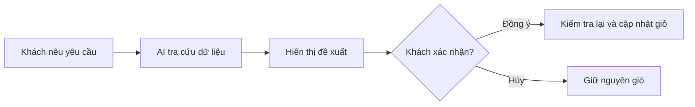
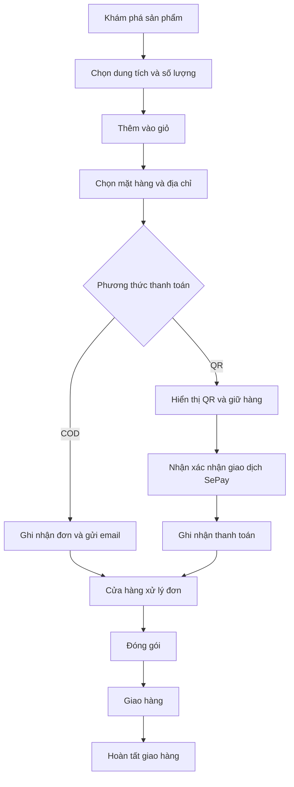
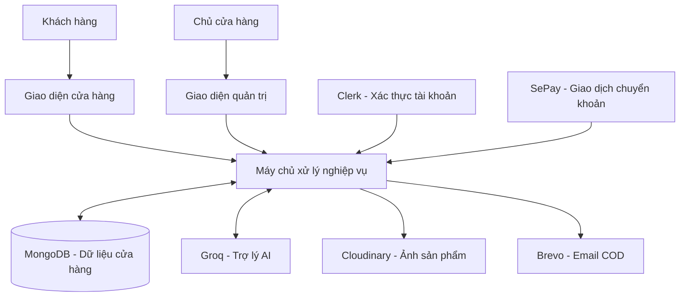

# VELOURS
### Mỹ phẩm, nước hoa & trải nghiệm mua sắm cùng AI

**Nền tảng thương mại điện tử kết hợp cửa hàng trực tuyến, thanh toán QR và trợ lý mua sắm AI trong cùng một trải nghiệm.**

[Giới thiệu](#gioi-thieu) · [Tính năng](#tinh-nang) · [Trợ lý AI](#tro-ly-ai) · [Công nghệ](#cong-nghe) · [Hướng phát triển](#huong-phat-trien)

---

| 🛍️ Dành cho khách hàng | 📊 Dành cho chủ cửa hàng | 🤖 Điểm nổi bật |
| --- | --- | --- |
| Khám phá sản phẩm, chọn dung tích, đặt hàng và theo dõi đơn | Quản lý sản phẩm, tồn kho, danh mục, đơn hàng và doanh thu | AI tra cứu dữ liệu cửa hàng, đề xuất thay đổi giỏ và chờ khách xác nhận |

## ✨ Velours?

**Velours** là website thương mại điện tử dành cho mỹ phẩm, nước hoa và sản phẩm chăm sóc cá nhân. Dự án kết nối các bước trong hành trình mua sắm: tìm hiểu sản phẩm, lựa chọn dung tích, quản lý giỏ hàng, chọn địa chỉ, thanh toán và theo dõi đơn.

Khách hàng có thể khám phá cửa hàng qua danh sách sản phẩm hoặc trao đổi với trợ lý AI bằng ngôn ngữ tự nhiên. Trợ lý hỗ trợ tìm kiếm, so sánh, kiểm tra giỏ hàng và tra cứu đơn dựa trên dữ liệu của hệ thống.

Đối với chủ cửa hàng, Velours cung cấp không gian quản trị riêng để cập nhật hàng hóa, điều chỉnh giá và tồn kho theo dung tích, xử lý đơn hàng và quan sát kết quả bán hàng.

### Giá trị mà dự án hướng đến

| Nhu cầu | Cách Velours giải quyết |
| --- | --- |
| Tìm sản phẩm phù hợp giữa nhiều lựa chọn | Kết hợp tìm kiếm, bộ lọc, sắp xếp giá và hội thoại AI |
| Phân biệt giá và tình trạng hàng giữa các dung tích | Mỗi dung tích có giá, số lượng tồn và trạng thái bán riêng |
| Mua hàng thuận tiện | Giỏ theo tài khoản, chọn mặt hàng thanh toán, địa chỉ đã lưu và hai phương thức thanh toán |
| Nắm được tiến độ đơn hàng | Lịch sử đơn và trạng thái xử lý trong tài khoản khách |
| Quản lý hoạt động bán hàng tập trung | Dashboard, quản lý sản phẩm, danh mục, tồn kho và đơn trong cùng hệ thống |
| Giữ quyền quyết định khi mua sắm bằng AI | Thay đổi giỏ chỉ được thực hiện sau khi khách xác nhận đề xuất |

---

## 🛍️ Trải nghiệm dành cho khách hàng

### Khám phá cửa hàng

Trang chủ giới thiệu sản phẩm mới, sản phẩm nổi bật và các nội dung về cửa hàng. Trang bộ sưu tập giúp khách thu hẹp lựa chọn theo nhóm sản phẩm, loại và mức giá thông qua tìm kiếm, bộ lọc và sắp xếp.

| Tính năng | Trải nghiệm |
| --- | --- |
| 🔎 **Tìm kiếm sản phẩm** | Tìm sản phẩm theo tên trong danh sách của cửa hàng |
| 🗂️ **Lọc danh mục và loại** | Kết hợp lựa chọn danh mục với các loại sản phẩm tương ứng |
| ↕️ **Sắp xếp theo giá** | Xem sản phẩm theo giá tăng dần hoặc giảm dần |
| 📄 **Phân trang** | Chia danh sách sản phẩm thành các trang dễ theo dõi |
| 🧴 **Chi tiết sản phẩm** | Xem hình ảnh, mô tả, thành phần nếu có và các dung tích |
| 🏷️ **Giá theo dung tích** | Giá thay đổi theo lựa chọn của khách |
| 📦 **Tình trạng hàng** | Chỉ cho phép mua dung tích đang bán và còn tồn kho |
| 💡 **Khám phá thêm** | Xem các nhóm sản phẩm liên quan và gợi ý kết hợp trên giao diện |
| 📱 **Giao diện responsive** | Bố cục thích ứng với màn hình máy tính và thiết bị di động |

### Tài khoản và giỏ hàng

Giỏ hàng được lưu theo tài khoản để khách tiếp tục mua sắm sau khi đăng nhập lại. Khách có thể điều chỉnh số lượng, xóa sản phẩm và chọn riêng những mặt hàng muốn thanh toán.

| Tính năng | Trải nghiệm |
| --- | --- |
| 🔐 **Đăng nhập bằng Clerk** | Xác thực tài khoản và quản lý phiên đăng nhập |
| 🛒 **Giỏ hàng theo tài khoản** | Lưu từng sản phẩm cùng dung tích và số lượng lựa chọn |
| ➕ **Điều chỉnh giỏ** | Thêm hàng, đổi số lượng hoặc xóa dòng sản phẩm |
| ☑️ **Thanh toán hàng đã chọn** | Chọn các mặt hàng cần mua trong giỏ |
| 📍 **Địa chỉ nhận hàng** | Thêm địa chỉ và chọn lại địa chỉ đã lưu |
| 🧾 **Tổng tiền rõ ràng** | Hiển thị tiền sản phẩm, phí vận chuyển và tổng thanh toán |
| 📬 **Email xác nhận COD** | Nhận thông tin đơn và sản phẩm sau khi đặt COD thành công |
| 🚚 **Theo dõi đơn** | Xem đơn COD và đơn QR đã ghi nhận thanh toán, cùng trạng thái xử lý |

---

## 🤖 Trợ lý mua sắm AI

**Velours AI** bổ sung một cách tương tác với cửa hàng qua hội thoại. Khách có thể nêu nhu cầu, hỏi thông tin sản phẩm hoặc kiểm tra đơn mà không phải tự chuyển qua nhiều màn hình.

Trợ lý gọi các công cụ truy vấn dữ liệu của cửa hàng để bổ sung thông tin cho câu trả lời. Kết quả có thể đi kèm thẻ sản phẩm, thông tin đơn, nội dung giỏ và đề xuất thao tác ngay trong khung chat.

### AI có thể hỗ trợ những gì?

| Khả năng | Ví dụ yêu cầu | Kết quả mong đợi |
| --- | --- | --- |
| 🔍 **Tìm kiếm sản phẩm** | “Tìm giúp tôi nước hoa dưới 500.000 đồng.” | Các sản phẩm phù hợp với dữ liệu cửa hàng |
| 🧴 **Xem chi tiết** | “Sản phẩm này có những dung tích nào còn hàng?” | Thông tin sản phẩm, giá và tình trạng các dung tích |
| ⚖️ **So sánh sản phẩm** | “So sánh hai sản phẩm tôi vừa chọn.” | Đối chiếu thông tin từ các sản phẩm được xác định |
| 🛒 **Kiểm tra giỏ** | “Giỏ hàng của tôi hiện có gì?” | Những mặt hàng của tài khoản đang đăng nhập |
| 📦 **Tra cứu đơn** | “Cho tôi xem những đơn hàng gần đây.” | Danh sách đơn thuộc tài khoản hiện tại |
| ➕ **Đề xuất thêm hàng** | “Thêm 1 sản phẩm này dung tích 100ml vào giỏ.” | Đề xuất để khách kiểm tra và xác nhận |
| ✏️ **Đề xuất sửa giỏ** | “Đổi số lượng sản phẩm này thành 2.” | Đề xuất cập nhật số lượng |
| 🗑️ **Đề xuất xóa hàng** | “Bỏ sản phẩm này khỏi giỏ giúp tôi.” | Đề xuất xóa dòng hàng được xác định |

Các ví dụ phụ thuộc vào sản phẩm và dung tích thực tế trong cửa hàng. Khi chưa đủ thông tin, trợ lý được hướng dẫn hỏi lại để xác định lựa chọn của khách.

### Khách hàng xác nhận trước khi thay đổi giỏ

Các công cụ đề xuất chỉ chuẩn bị hành động. Giỏ hàng được cập nhật sau khi khách bấm xác nhận và hệ thống kiểm tra lại sản phẩm, dung tích, số lượng. AI không có công cụ tự thanh toán hoặc tạo đơn hàng.

### Phạm vi truy cập của trợ lý

- **Gắn với người đang đăng nhập:** thông tin đơn và giỏ được truy vấn theo tài khoản đã xác thực.
- **Giới hạn dữ liệu cá nhân:** kết quả từ công cụ đơn/giỏ không chứa địa chỉ, email, điện thoại hoặc mã giao dịch thanh toán.
- **Giới hạn lượt sử dụng:** mặc định 5 yêu cầu/phút và 20 yêu cầu/ngày cho mỗi tài khoản.
- **Giới hạn công cụ:** mỗi yêu cầu được thực thi tối đa 4 lượt gọi công cụ.
- **Nhật ký hoạt động:** ghi nhận kết quả gọi công cụ với các tham số được lọc và thời hạn lưu.
- **Dịch vụ AI:** nội dung hội thoại và dữ liệu công cụ được chọn được gửi đến Groq để tạo câu trả lời.

---

## 💳 Thanh toán và quản lý đơn hàng

Velours hỗ trợ **thanh toán khi nhận hàng (COD)** và **chuyển khoản bằng mã QR**.

| Nội dung | COD | Chuyển khoản QR |
| --- | --- | --- |
| Thời điểm thanh toán | Khi nhận hàng | Chuyển khoản theo mã QR |
| Ghi nhận đơn | Sau khi thông tin đặt hàng được kiểm tra | Tạo phiên chờ thanh toán và giữ hàng |
| Xác nhận đã trả tiền | Khi quản trị chuyển đơn sang đã giao | Sau khi webhook SePay được kiểm tra và chấp nhận |
| Xử lý tồn kho | Trừ kho khi tạo đơn thành công | Giữ kho trong phiên chờ, hoàn lại khi hủy hoặc xử lý hết hạn |
| Thông báo | Email xác nhận COD | Kết quả thanh toán trên giao diện |

### Luồng mua hàng

### Điểm nổi bật của thanh toán QR

- Mỗi đơn có mã thanh toán riêng để đối chiếu giao dịch.
- Phiên chờ có thời hạn **5 phút** và hiển thị thời gian còn lại.
- Có thể khôi phục phiên chờ còn hiệu lực khi khách quay lại.
- Giao diện kiểm tra trạng thái định kỳ để cập nhật kết quả.
- Khách có thể hủy phiên đang chờ; lượng hàng đã giữ được hoàn lại.
- Hệ thống kiểm tra mã giao dịch để hạn chế ghi nhận lặp khi nhận lại webhook.
- Với đơn đã được xử lý hết hạn nhưng nhận tiền muộn, hệ thống kiểm tra lại hàng; trường hợp không đáp ứng được chuyển sang trạng thái cần xem xét.

Hiện việc giải phóng các phiên hết hạn diễn ra khi có yêu cầu liên quan đến đặt hàng hoặc kiểm tra thanh toán; chưa có tác vụ nền quét độc lập. Email xác nhận tự động hiện được tích hợp cho COD.

### Phí vận chuyển

| Giá trị tiền hàng | Phí vận chuyển |
| --- | --- |
| Dưới 1.000.000 VNĐ, giỏ có hàng | 30.000 VNĐ |
| Từ 1.000.000 VNĐ | Miễn phí |

### Trạng thái đơn hàng

| Nhóm | Trạng thái |
| --- | --- |
| Thanh toán QR | Chờ thanh toán · Hết hạn · Đã hủy · Cần xem xét |
| Xử lý đơn | Đã đặt hàng · Đang đóng gói · Đang giao · Đã giao |

---

## 📊 Không gian quản trị cửa hàng

Velours tập trung các công việc quản lý vào khu vực riêng dành cho chủ cửa hàng. Hệ thống hỗ trợ nhiều tài khoản quản trị trong mô hình một cửa hàng.

### Dashboard và theo dõi bán hàng

| Tính năng | Giá trị sử dụng |
| --- | --- |
| 💰 **Tổng doanh thu đã thanh toán** | Quan sát giá trị của các đơn đã ghi nhận thanh toán |
| 🧾 **Số lượng đơn** | Nắm quy mô đơn COD và đơn QR đã thanh toán trong danh sách quản lý |
| 📈 **Biểu đồ theo tháng** | Đối chiếu tổng giá trị đơn với giá trị đã thanh toán trong 6 tháng, lấy tháng của đơn mới nhất làm mốc |
| 🏷️ **Sản phẩm có lượng mua cao** | Xem nhóm sản phẩm được mua nhiều dựa trên dữ liệu đơn |
| 📋 **Thông tin đơn chi tiết** | Xem mặt hàng, dung tích, số lượng, địa chỉ và phương thức thanh toán |
| 🚚 **Cập nhật tiến độ** | Chuyển trạng thái đơn theo quá trình xử lý của cửa hàng |

### Sản phẩm, danh mục và tồn kho

| Tính năng | Mô tả |
| --- | --- |
| ✏️ **Quản lý sản phẩm** | Thêm, sửa thông tin và xóa mềm sản phẩm |
| 🖼️ **Hình ảnh sản phẩm** | Lưu tối đa 4 ảnh cho mỗi sản phẩm qua Cloudinary |
| 🧴 **Quản lý dung tích** | Mỗi lựa chọn có giá, số lượng tồn và trạng thái bán riêng |
| 🔘 **Bật/tắt bán** | Điều chỉnh trạng thái toàn sản phẩm hoặc từng dung tích |
| ⭐ **Sản phẩm nổi bật** | Đánh dấu sản phẩm để phục vụ các khu vực giới thiệu |
| 🗂️ **Danh mục và loại** | Tổ chức catalog theo danh mục cùng các loại bên trong |
| 🔄 **Đồng bộ khi đổi tên** | Cập nhật tên danh mục/loại trên sản phẩm liên quan |
| 🔗 **Kiểm tra trước khi xóa** | Chặn xóa danh mục/loại vẫn được sản phẩm chưa xóa sử dụng |

Xóa mềm giúp ngừng hiển thị và bán một sản phẩm, đồng thời giữ dữ liệu phục vụ đơn hàng cũ. Những mặt hàng đã mua có bản chụp tên, ảnh, giá và dung tích tại thời điểm đặt hàng.

---

## 🧩 Những điểm nổi bật trong thiết kế

| Điểm thiết kế | Cách ứng dụng trong Velours | Ý nghĩa |
| --- | --- | --- |
| **Tồn kho theo dung tích** | Giá, số lượng và trạng thái bán riêng cho mỗi biến thể | Phù hợp đặc thù mỹ phẩm, nước hoa |
| **Tính tiền phía máy chủ** | Giá đơn lấy từ dữ liệu sản phẩm và quy tắc vận chuyển | Giữ cách tính tiền nhất quán khi đặt hàng |
| **Giao dịch dữ liệu** | Tạo đơn và cập nhật tồn kho trong transaction | Giữ các thay đổi liên quan nhất quán |
| **Giữ hàng khi chờ QR** | Tạm giữ số lượng trong phiên thanh toán | Gắn việc chờ tiền với lượng hàng có thể đáp ứng |
| **Lưu thông tin lúc mua** | Đơn giữ bản chụp thông tin sản phẩm | Hạn chế ảnh hưởng khi catalog thay đổi |
| **AI gọi công cụ** | Truy vấn dữ liệu cửa hàng để hỗ trợ hội thoại | Câu trả lời có thông tin từ sản phẩm, giỏ và đơn thực tế |
| **Xác nhận hành động AI** | Khách xem đề xuất trước khi giỏ thay đổi | Giữ quyền quyết định cho khách hàng |
| **Phân quyền máy chủ** | Kiểm tra tài khoản và quyền quản trị khi xử lý yêu cầu | Tách quyền khách hàng với chủ cửa hàng |
| **Giới hạn sử dụng AI** | Quota theo tài khoản và giới hạn lượt công cụ | Kiểm soát tần suất xử lý hội thoại |

---

## ⚙️ Công nghệ xây dựng dự án

### Giao diện và trải nghiệm

| Công nghệ | Vai trò trong sản phẩm |
| --- | --- |
| **React 19** | Xây dựng giao diện cửa hàng, giỏ, quản trị và chat AI |
| **Vite 8** | Công cụ phát triển và đóng gói frontend |
| **Tailwind CSS 4** | Định dạng giao diện và bố cục responsive |
| **React Router** | Điều hướng giữa các màn hình |
| **React Context & Hooks** | Quản lý trạng thái ứng dụng, giỏ và hội thoại |
| **Axios** | Trao đổi dữ liệu giữa giao diện và máy chủ |
| **Recharts** | Biểu đồ thống kê bán hàng |
| **Swiper, Lucide React, React Hot Toast** | Slider, biểu tượng và thông báo thao tác |

### Dữ liệu và dịch vụ

| Công nghệ | Vai trò trong sản phẩm |
| --- | --- |
| **Node.js & Express 5** | Xử lý nghiệp vụ, yêu cầu dữ liệu và webhook |
| **MongoDB & Mongoose** | Lưu người dùng, sản phẩm, danh mục, địa chỉ, đơn và dữ liệu hoạt động AI |
| **Clerk & Svix** | Xác thực, quản lý phiên và xác minh sự kiện đồng bộ tài khoản |
| **Cloudinary & Multer** | Tiếp nhận và lưu trữ hình ảnh sản phẩm |
| **SePay & QR qua vietqr.app** | Đối soát chuyển khoản và hiển thị mã QR |
| **Nodemailer & Brevo SMTP** | Email xác nhận đơn COD |
| **Groq** | Xử lý hội thoại AI và yêu cầu gọi công cụ |
| **Node.js Test Runner & ESLint** | Kiểm thử nghiệp vụ và kiểm tra mã |

### Kiến trúc tổng quan

Giao diện phụ trách hiển thị và tương tác. Máy chủ xử lý xác thực, quyền truy cập, giá, tồn kho, đơn và các tích hợp. Dữ liệu cửa hàng được lưu tập trung trong MongoDB.

---

## 🗃️ Các nhóm dữ liệu chính

| Nhóm dữ liệu | Nội dung quản lý |
| --- | --- |
| **Người dùng** | Hồ sơ tài khoản, vai trò và giỏ hàng |
| **Sản phẩm** | Thông tin giới thiệu, ảnh, thành phần, dung tích, giá và tồn kho |
| **Danh mục** | Nhóm sản phẩm và các loại bên trong |
| **Địa chỉ** | Thông tin nhận hàng gắn với tài khoản |
| **Đơn hàng** | Mặt hàng đã mua, số lượng, giá lúc mua, tổng tiền, trạng thái và thanh toán |
| **Lượt sử dụng AI** | Tần suất gửi yêu cầu theo tài khoản và khoảng thời gian |
| **Nhật ký công cụ AI** | Công cụ đã gọi, kết quả, thời gian xử lý và tham số được lọc |

Một tài khoản có thể có nhiều địa chỉ và đơn hàng. Mỗi sản phẩm có nhiều lựa chọn dung tích. Dữ liệu đơn giữ thông tin hàng đã mua để có thể theo dõi lịch sử khi sản phẩm được cập nhật.

---

## 🧪 Kiểm chứng chất lượng

Các bài kiểm thử tập trung vào những phần ảnh hưởng trực tiếp đến việc mua hàng, dữ liệu tài khoản và hành động AI.

| Phạm vi | Nội dung được kiểm tra |
| --- | --- |
| **Giá và tồn kho** | Ngưỡng miễn phí vận chuyển, trạng thái dung tích |
| **Đơn và thanh toán** | Hoàn kho khi hủy QR, dữ liệu webhook, ghi nhận COD khi đã giao |
| **Phân quyền** | Quyền quản trị, danh sách tài khoản được cấp quyền |
| **Danh mục** | Đổi tên, đồng bộ sản phẩm và điều kiện xóa |
| **Email** | Thông tin lúc mua, tổng tiền, nội dung COD và xử lý nội dung HTML |
| **Trợ lý AI** | Tìm kiếm, so sánh, chuỗi gọi công cụ và giới hạn xử lý |
| **Dữ liệu cá nhân** | Công cụ chỉ truy vấn giỏ/đơn của tài khoản hiện tại |
| **Xác nhận giỏ** | Đề xuất AI chưa ghi dữ liệu trước khi được xác nhận |
| **Quota AI** | Giới hạn lượt dùng và xử lý khi dịch vụ lưu quota gặp lỗi |

Lần kiểm tra cục bộ gần nhất trong quá trình cập nhật tài liệu ghi nhận **64/64 bài kiểm thử backend đạt**, cùng kiểm tra lint và build frontend thành công. Bộ test có sử dụng mock/stub; kết quả này chưa thay thế kiểm thử toàn bộ luồng với các dịch vụ bên ngoài hoặc đánh giá độ chính xác câu trả lời AI.

---

## 🚀 Hướng phát triển

Velours hiện tập trung vào mua sắm, quản trị cửa hàng, thanh toán COD/QR và trợ lý AI. Những hướng mở rộng tiếp theo gồm:

| Hướng mở rộng | Giá trị dự kiến |
| --- | --- |
| ⭐ **Đánh giá và nhận xét** | Bổ sung phản hồi từ người đã mua hàng |
| ❤️ **Danh sách yêu thích** | Giúp khách lưu sản phẩm quan tâm |
| 🎟️ **Ưu đãi và mã giảm giá** | Hỗ trợ chương trình khuyến mãi |
| 🚚 **Tích hợp vận chuyển** | Theo dõi mã vận đơn, tính phí theo địa chỉ |
| ↩️ **Đổi trả và hoàn tiền** | Hoàn thiện quy trình sau mua |
| 📝 **Blog và liên hệ hoàn chỉnh** | Quản lý bài viết và tiếp nhận yêu cầu hỗ trợ |
| 💬 **Lịch sử hội thoại** | Tiếp tục cuộc trao đổi theo lựa chọn của người dùng |
| ⏱️ **Xử lý tác vụ nền** | Chủ động dọn phiên QR hết hạn và gửi email qua hàng đợi |
| 🔎 **Tìm kiếm cho catalog lớn** | Lọc và phân trang trên máy chủ |
| 🧪 **Kiểm thử mở rộng** | Bổ sung E2E, kiểm thử đồng thời và bộ đánh giá AI |

Các mục trên là định hướng, chưa được mô tả như chức năng đã hoàn thành. Blog hiện dùng nội dung mẫu, Contact mới có giao diện; các đánh giá mẫu và gợi ý sản phẩm chưa phải hệ thống đánh giá khách hàng hoặc mô hình đề xuất được huấn luyện riêng.

---

**VELOURS**

Khám phá sản phẩm · Mua sắm cùng AI · Quản lý cửa hàng tập trung

